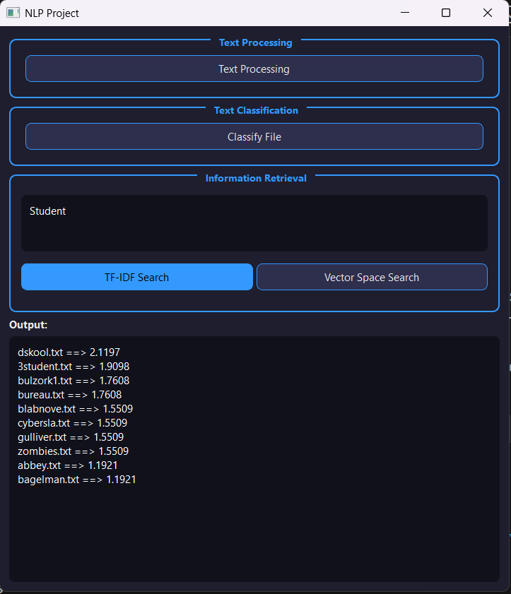
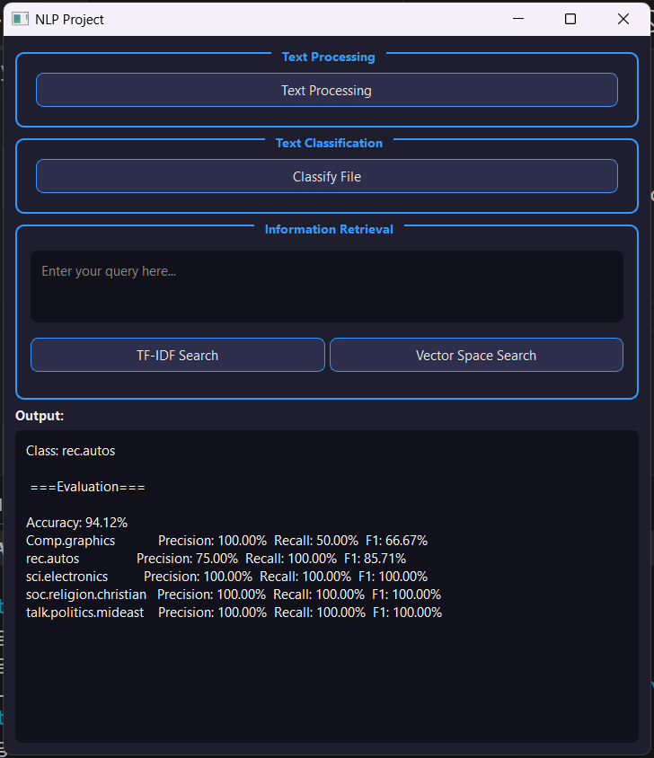

# NLP Information Retrieval & Text Classification

A Python-based Natural Language Processing project that implements **text preprocessing, Naive Bayes text classification, and information retrieval** from scratch.

The project also includes a **PyQt5 graphical user interface** for interacting with the implemented NLP components.
## Screenshots

### Information Retrieval



### Text Classification


## Features

* Text preprocessing pipeline

  * URL and HTML removal
  * Emoji removal
  * Tokenization
  * Lowercasing
  * Stop-word removal
  * Porter stemming
  * Word frequency analysis

* Text classification

  * Naive Bayes classifier implemented from scratch
  * Laplace smoothing
  * Log-probability calculation
  * Document classification
  * Evaluation using:

    * Accuracy
    * Precision
    * Recall
    * F1-score
    * Confusion matrix

* Information Retrieval

  * TF-IDF weighting
  * TF-IDF based document ranking
  * Vector Space Model (VSM)
  * Cosine similarity
  * Top-k document retrieval

* Graphical User Interface

  * Built with PyQt5
  * Text preprocessing interface
  * File classification
  * TF-IDF search
  * Vector Space search

## Technologies

* Python
* PyQt5
* NLTK
* Regular Expressions
* Object-Oriented Programming
* Natural Language Processing
* Information Retrieval
* Machine Learning

## Project Structure

```text
NLP-Project/
│
├── src/
│   ├── text_processing.py
│   ├── classification.py
│   ├── information_retrieval.py
│   └── file_handler.py
│
├── datasets/
│   ├── Classification-Train And Test/
│   └── IR/
│       └── IR Documents to Index/
│
├── processed_output/
│
├── gui.py
├── requirements.txt
├── README.md
└── .gitignore
```

## Text Processing Pipeline

The preprocessing pipeline follows these steps:

```text
Raw Text
   │
   ▼
Clean Text
   │
   ▼
Tokenization
   │
   ▼
Lowercasing
   │
   ▼
Stop-word Removal
   │
   ▼
Porter Stemming
   │
   ▼
Word Frequency
```

The processing functions are implemented manually using Python and regular expressions, with `PorterStemmer` from NLTK used for stemming.

## Text Classification

The classification component implements a **Multinomial Naive Bayes-style classifier** without using a machine-learning library such as scikit-learn.

For each class, the model calculates:

* Class prior probability:

```text
P(c) = documents_in_class / total_documents
```

* Smoothed word likelihood:

```text
P(w|c) = (count(w,c) + 1) / (total_words_in_class + |V|)
```

where `|V|` is the vocabulary size.

Log probabilities are used to avoid numerical underflow:

```text
log P(c|d) =
    log P(c) +
    Σ frequency(w,d) × log P(w|c)
```

The class with the highest score is selected as the prediction.

### Evaluation

The classifier is evaluated using:

```text
Accuracy
Precision
Recall
F1-score
Confusion Matrix
```

The evaluation results are displayed directly in the application.

## Information Retrieval

The Information Retrieval module supports two ranking methods.

### TF-IDF

TF-IDF is calculated using:

```text
IDF(t) = log10(N / DF(t))
```

and the term weight:

```text
TF-IDF(t,d) =
    (1 + log10(TF(t,d))) × IDF(t)
```

Documents are ranked by the sum of TF-IDF weights for query terms.

### Vector Space Model

The project also represents queries and documents as TF-IDF vectors and calculates their similarity using cosine similarity:

```text
cosine(q,d) = (q · d) / (||q|| × ||d||)
```

The documents with the highest similarity scores are returned.

## GUI

The application provides a simple PyQt5 interface with four main operations:

1. **Text Processing**
   Select a `.txt` file and run the complete preprocessing pipeline.

2. **Classify File**
   Select a text file and predict its class using the trained Naive Bayes model.

3. **TF-IDF Search**
   Enter a query and retrieve the most relevant documents using TF-IDF scores.

4. **Vector Space Search**
   Enter a query and retrieve documents using cosine similarity.

## Installation

Clone the repository:

```bash
git clone <repository-url>
cd NLP-Project
```

Create and activate a virtual environment:

```bash
python -m venv .venv
```

On Windows:

```bash
.venv\Scripts\activate
```

Install dependencies:

```bash
pip install -r requirements.txt
```

## Running the Application

Run the main GUI:

```bash
python gui.py
```

The application will load the classification and information retrieval models and open the PyQt5 interface.

## Example Workflow

### Text Processing

Select a text file and the application generates processed outputs such as:

```text
processed_output/
├── tokens.txt
├── lowercase.txt
├── no_stopwords.txt
├── stemmed.txt
└── word_frequency.txt
```

### Classification

Select a test document:

```text
Input Document
      │
      ▼
Preprocessing
      │
      ▼
Naive Bayes
      │
      ▼
Predicted Class
```

### Information Retrieval

Enter a query such as:

```text
machine learning algorithms
```

The system returns the top-ranked documents:

```text
document_01.txt ==> 0.XXXX
document_15.txt ==> 0.XXXX
document_07.txt ==> 0.XXXX
...
```

## Design Approach

The project separates the main NLP components into independent modules:

```text
                    ┌──────────────────┐
                    │      PyQt5       │
                    │       GUI        │
                    └────────┬─────────┘
                             │
              ┌──────────────┼──────────────┐
              ▼              ▼              ▼
      Text Processing  Classification  Information
                                      Retrieval
              │              │              │
              └──────────────┴──────────────┘
                             │
                       File Handler
```

This modular structure makes each component easier to test, maintain, and extend.

## Future Improvements

Possible future improvements include:

* Add more advanced text normalization
* Add configurable preprocessing options
* Improve the GUI with result tables and visualizations
* Add more classification algorithms
* Add retrieval evaluation metrics such as Precision@K and Recall@K
* Add automated unit tests
* Improve model loading and caching
* Add support for larger datasets

## Author

**Newsha Varnaseri**

Computer Engineering Student — AI

---

```
This project was developed for educational purposes to explore fundamental NLP,
Machine Learning, and Information Retrieval concepts through manual implementation.
```
